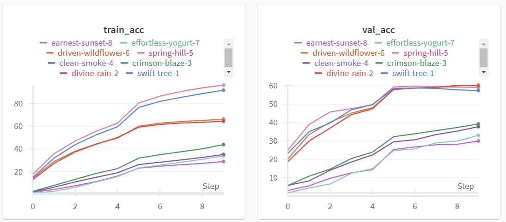

# Parameter sweep results
The full execution configuration for a pipeline instance can be found in `config.json`. The parameters sweeped are found in `sweep.json` and are combined using grid search, by sweep.py.  They are as follows:
## Parameters

 - Models: 
	 - v1: `PreActResNet18` for CIFAR-100
	 - v2: `VGG16` for CIFAR-100
- Optimizers:
	- v1: SGD with momentum (0.9), weight decay (0.0005), Nesterov, Learning rate 0.005 
	- v2: AdamW, weight decay 0.01, learning rate 0.005
- Data augmentations
	- v1: Basic augmentation with normalization
	- v2: Basic augmentation with normalization + random cropping + random horizontal flip

## Experimental results
All the experiments were ran for 10 epochs.
Wandb: https://wandb.ai/alexandrualiciuc-universitatea-alexandru-ioan-cuza-din-ia-i/hw3-part2-parameter-sweep
|Nr.|Parameter combination |Train acc %|Validation Acc %|
|--|--|--|--|
|1 | Model-v1, Optimizer-v1, Augmentation-v1 | 91.716 |57.37|
|2| Model-v1, Optimizer-v1, Augmentation-v2 | 64.458 |60|
|3| Model-v1, Optimizer-v2, Augmentation-v1 | 43.794 |39.21|
|4| Model-v1, Optimizer-v2, Augmentation-v2 | 35.124 |37.73|
|5| Model-v2, Optimizer-v1, Augmentation-v1 |96.348 |59.09|
|6| Model-v2, Optimizer-v1, Augmentation-v2 |66.166 |60.39|
|7| Model-v2, Optimizer-v2, Augmentation-v1 |33.834 |33.03|
|8| Model-v2, Optimizer-v2, Augmentation-v2 |28.916 |29.94|

The results show that augmentation is very beneficial in combatting overfitting. Also, the SGD optimizer seems to achieve better performance.

In order to improve make the pipeline more efficient I implemented the following:
- Dataset caching
- Option to pin memory, configurable by the user
- Option to use 16-bit floating-point instead of the default 32-bit, configurable by the user
- JIT Script compiling

Expected total points:
 - 10 points for part 1
 - 6 points for the experiments
 - 2 points for optimizations